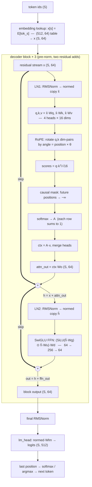

# AI Transformer Demo (Four-Backend)

A pedagogical implementation of a decoder-only transformer with **four
equivalent backends**: NumPy (pure manual math, the teaching reference),
PyTorch (the production idiom), Triton (GPU kernels over a PyTorch model),
and CUDA (bare-metal NVRTC kernels). All four tracks share the same
architecture, the same key scheme, and the same config — a model trained on
one track loads and runs on any other. A **learning mode** adds an
interactive web page (any of the four backends, selected in-page) that
visualizes the architecture, shows every intermediate tensor of an
inference, and exports full inference records.

## What each track teaches

Each track answers a different question about the *same* model:

| Track | Question it answers | Read it for |
| --- | --- | --- |
| **NumPy** (`impl/_np/`) | *How does the math work?* | Hand-derived forward + analytic backward, formula citations, shape comments on every matrix op. The teaching reference. |
| **PyTorch** (`impl/_torch/`) | *How do you implement it properly with a framework?* | Production idiom: `nn.Module` composition, autograd, `F.scaled_dot_product_attention`, `torch.optim`. |
| **Triton** (`impl/_triton/`) | *How do you write the kernels?* | Memory-traffic-aware GPU kernels (online softmax / FlashAttention) over a PyTorch skeleton. |
| **CUDA** (`impl/_cuda/`) | *What does the metal see?* | Bare-metal NVRTC kernels, explicit launches, no framework. |

Because all four implement bit-comparable behavior on one checkpoint format,
you can trace the same tensor through four increasingly low-level lenses.

See [CONTEXT.md](CONTEXT.md) for the domain glossary,
[docs/theory/transformer-walkthrough.md](docs/theory/transformer-walkthrough.md)
for a stage-by-stage tour of the forward pass (equations + code pointers),
[docs/specs/architecture-fixes.md](docs/specs/architecture-fixes.md) for the
architecture spec and progress,
[docs/seam_triton_to_torch.md](docs/seam_triton_to_torch.md) for the
documented Triton→PyTorch shared seam, and [AGENTS.md](AGENTS.md) for
repository guidelines and development rules.

## The learning-mode example model

`scripts/learning.py` serves `resource/models/learning_tool/` by default: a
**262,592-parameter** decoder-only transformer, trained by
[`scripts/train_demo_model_v2.py`](scripts/train_demo_model_v2.py) in three
stages — pre-train on TinyStories (`learning_base`), fine-tune on code
instructions (`learning_sft`), fine-tune on tool-call JSON (`learning_tool`).
The web page's compare tab loads all three, so you can watch identical
architecture + initialization diverge purely from fine-tuning data. A smaller
char-level MoE demo (`learning_demo`, D=8, V=20 — the legacy pre-SFT demo)
exists for inspecting MoE internals; below is the **default** model.

| Hyperparameter | Value | Choice & why |
| --- | --- | --- |
| `vocab_size` | 512 | Byte-level BPE, case preserved, with 8 special tokens (`<|tool_call|>`, ` ```input `, …) so SFT can teach chat/tool shapes. Small enough that the full softmax fits on screen. |
| `context_length` | 128 | Sequences are truncated/padded to 128; every (S, …) tensor in the record has ≤129 rows — inspectable by eye. |
| `embed_dim` D | 64 | Model width. Small enough that every attention score, expert weight, and residual value can be printed in full. |
| `n_layers` L | 3 | Three repeated decoder blocks — deep enough to show how the residual stream accumulates, shallow enough to follow end to end. |
| `n_heads` H | 4 (`n_groups=4`) | Head dim = 16. `n_groups == n_heads` → every head has its own K/V (plain MHA); set `n_groups < n_heads` in config and the same code runs GQA. |
| `rope_dim` | 0 | 0 rotates the full head dim (standard RoPE); no learned position embedding anywhere. |
| `n_experts` | 1 | Dense SwiGLU FFN (`expert_dim = 256 = 4·D`). MoE is opt-in (`n_experts > 1` adds a router + top-k); the `learning_demo` checkpoint demonstrates it. |
| biases / weight tying | none | LLaMA convention: RMSNorm has only γ, all projections are bias-free, `lm_head` is its own matrix (not the tied embedding). |

### Architecture diagram (one forward pass)



Thick `==>` edges are the residual stream's skip connections; the two norms
read *copies* (`x̂`, `ĥ`) — the stream itself is never normalized. At
generation time each block additionally keeps a K/V cache (prefill writes the
whole prompt, each decode appends one row), but the math above is unchanged —
see `NumPyModel.make_cache` / `forward_prefill` / `forward_step` in
`impl/_np/model.py`.

### The math and the intuition, per component

**Embedding** — `x[s] = E[token[s]]`, a pure (512, 64) table row-gather.
No arithmetic, and *no position information*: the same token id gets the same
vector wherever it sits. Order enters later, inside attention, via RoPE.
(`impl/_np/embedding.py`)

**Two RMSNorms per block (LN1, LN2)** — math: `x̂_d = x_d / sqrt(mean_d(x²) + ε)`, then `y = γ ⊙ x̂` (64 learned gains per norm; no mean subtraction, no bias). *Why two?* Because two sublayers read the residual stream at different points: attention reads `x`, the FFN reads `h = x + attn(x)` — different scales, so each gets its own calibration. Attention is especially scale-sensitive: `q·k` grows quadratically with input magnitude, and softmax saturates (gradients die) on large scores. *Why pre-norm?* The norm sits **inside** the branch, not on the stream: `x` and `h` are never rewritten, only their copies are — the identity path through all 3 blocks stays exact. RMSNorm vs LayerNorm: the same stabilizing effect with one fewer statistic. (`impl/_np/layernorm.py`)

**Attention (MHA)** — `q = x̂·Wq, k = x̂·Wk, v = x̂·Wv` turn one input into three roles (what I look for / what I advertise / what I pass on); `s_ij = q_i·k_j/√16` measures alignment — the `√16` keeps pre-softmax scores near unit variance; the causal mask sets `s_ij = −∞` for `j > i` so a position can only read its past; `A = softmax(s)` turns scores into a mixing recipe (rows sum to 1); `ctx_i = Σ_j A_ij·v_j` mixes content; `attn_out = ctx·Wo` merges the 4 heads back to width 64. This is the **only** stage where tokens exchange information — everything else is per-position. (`impl/_np/attention.py`)

**RoPE** — head dims are grouped into pairs and rotated by `angle = position · 10000^(−2i/16)`. After rotation, `q·k` depends on the *relative distance* between positions, so attention can prefer nearby or fixed-offset tokens without any positions stored in the weights — which is why the embedding needs no position table. (`impl/_np/rope.py`)

**Two residual adds** — `h = x + attn(LN1(x))`, `out = h + ffn(LN2(h))`. Each sublayer follows the same contract — *read the stream through its own norm, compute a delta, add it back* — so after 3 blocks the hidden state is `x + Σ(every block's two deltas)`; nothing is ever overwritten. The math of why depth trains: `∂h/∂x = I + ∂attn/∂x`, and the identity term carries gradients to the earliest block unshrunk (the "gradient highway"). Intuition: each block is a small correction, not a rewrite. (`impl/_np/block.py`)

**Dense SwiGLU FFN (64 → 256 → 64)** — `out = (SiLU(x̂·Wg) ⊙ x̂·Wu)·Wd` with `SiLU(z) = z·σ(z)`. Two parallel projections: one computes *content*, the other a smooth *gate* (smooth at 0, unlike ReLU — no dead zones); their element-wise product is the non-linearity, and `Wd` compresses back to 64. Attention routes information *between* tokens; the FFN is where each token's content is actually processed — most parameters live here (49,152 of 65,664 per block). (`impl/_np/ffn.py`)

**Final norm + lm_head** — the fully accumulated stream is RMSNormed once more, then `logits[s] = normed[s]·W_lm ∈ R^512`: every position is scored against every vocabulary row. The largest logit of the last position is the model's next-token guess; softmax (+ temperature / top-k) turns it into the sampling distribution. `lm_head` is deliberately *not* tied to the embedding — 512×64 parameters each, two separate matrices. (`impl/_np/model.py`)

**Training pipeline** — same weights and architecture throughout; only the data changes: TinyStories → English fluency, code instructions → instruction→code behavior, tool calls → OpenAI-style JSON tool messages (teacher-forced next-token loss, AdamW; `scripts/train_demo_model_v2.py`, ~minutes on the Jetson).

## Features

- **Four backends, one model**: NumPy (analytic backward, the math
  reference), PyTorch (autograd + `F.scaled_dot_product_attention` +
  `torch.optim`), Triton (FlashAttention-style online-softmax kernel), CUDA
  (NVRTC kernels for RMSNorm, RoPE, attention, FFN).
- **Standard architecture**: pre-norm LLaMA block
  (`h = x + attn(ln1(x)); out = h + mlp(ln2(h))`), RMSNorm, GQA, RoPE,
  SwiGLU (dense by default; MoE is opt-in), causal mask, no weight tying, no
  biases.
- **KV cache**: the per-token step path is exact (`forward_prefill` +
  `forward_step` == full re-forward). The generators step one token per
  iteration (O(1) per step). TurboQuant (1-bit quantized cache) is wired as
  an alternative with a parity-budget test.
- **Analytic backward** (NumPy): every operator has a closed-form
  `backward(dout, x) -> (dinput, dparams)`; `check_model_gradients` verifies
  it against finite differences (float64, ~1e-10, MoE top-k kink-aware).
- **Cross-backend parity**: three-tier tolerance policy (see AGENTS.md rule
  2); 49 cross-backend tests cover dense/GQA/MoE parity, GPU parity, and a
  3-way equivalence demo; `scripts.verify_equivalence` runs 7 end-to-end
  scenarios.
- **Checkpoint interchange**: one flat-dict key scheme
  (`shared.constants.Keys`, HF-Llama naming) + a parameter registry
  (`shared/registry.py`) that validates shape and key-set on load
  (stale checkpoints fail fast).
- **Learning mode** (all four backends): `scripts/learning.py` hosts a web
  page (stdlib HTTP server, no dependencies) with prompt + generation, an
  architecture diagram with flow navigation (click a node to light up its
  predecessors/successors) and per-block numbers, and downloadable JSON
  inference records of every intermediate tensor. The page runs records on
  all four backends via an in-page dropdown; the CLI `--backend numpy|torch`
  only picks which track the startup load materializes. All record adapters
  emit the same JSON shapes, so the page consumes any backend
  interchangeably.
- **Real-data training**: TinyStories (GPT-2 BPE, vocab 50,257) dataset
  pipeline in `shared/dataset.py`, plus a char-level tokenizer for the tiny
  demo model; unified train/infer scripts for all four backends.

## Installation

```bash
uv sync
```

Python 3.10; torch is pinned to `2.13.0+cu132` via a custom uv index.

## Usage

### Inference

```bash
# NumPy
uv run python -m impl._np.cli --prompt "the" --max_new_tokens 10

# PyTorch
uv run python -m impl._torch.cli --prompt "the" --max_new_tokens 10

# Triton (GPU)
uv run python -m impl._triton.cli --prompt "the" --max_new_tokens 10

# CUDA (GPU)
uv run python -m impl._cuda.cli --prompt "the" --max_new_tokens 10

# With custom parameters
uv run python -m impl._torch.cli \
    --prompt "Once upon a" --max_new_tokens 50 \
    --temperature 0.9 --top_k 20 \
    --embed_dim 64 --n_layers 4 --n_heads 8

# Unified script (any backend, any checkpoint)
uv run python -m scripts.infer --model resource/models/torch_real/ --backend torch --prompt "hello"
```

### Learning mode (web page)

```bash
# Serves http://0.0.0.0:8080 by default; a first run with no checkpoints
# bootstraps them via scripts.train_demo_model_v2
uv run python -m scripts.learning

# The page runs all four backends via its in-page dropdown; --backend only
# picks the startup load (numpy [default] or torch); port/model overridable
uv run python -m scripts.learning --backend torch
uv run python -m scripts.learning --port 9000 --model resource/models/torch_real

# Rebuild the default served checkpoints (learning_base/_sft/_tool:
# 3-stage pretrain→SFT→tool pipeline, BPE-512, D=64, L=3, H=4 — see
# "The learning-mode example model" above)
uv run python -m scripts.train_demo_model_v2

# Or build the legacy char-level MoE demo (D=8, H=4, L=3, E=3 routed +
# n_shared_experts=1, V=20) and serve it explicitly via --model
uv run python -m scripts.train_demo_model
uv run python -m scripts.train_demo_model --backend cuda   # GPU backends too
uv run python -m scripts.learning --model resource/models/learning_demo
```

### Training

```bash
# Unified training (all backends)
uv run python -m scripts.train --backend numpy|torch|triton|cuda

# Options: --synthetic (no dataset), --n_layers, --embed_dim, --n_experts,
# --save_dir, ...
uv run python -m scripts.train --backend torch --synthetic --epochs 3
```

### Real-data checkpoints (TinyStories)

The 4-backend "real" checkpoints (`resource/models/{backend}_real/`) train all four
backends on the TinyStories dataset (GPT-2 BPE, vocab 50,257) from an identical
weight start, then save one checkpoint per backend. They total ~150 MB (the
50,257-wide embedding + lm_head dominate — the transformer itself is only ~1 MB),
so they are **git-ignored**, not committed. Recreate any time:

```bash
# Full reproduction (all 4 backends, ~150 MB, ~1-2 min on the GPU)
uv run python -m scripts.train_real_tinystories

# Quick small check (2 backends, 5 steps, throwaway suffix)
uv run python -m scripts.train_real_tinystories --backends numpy,torch --num_batches 5 --suffix tmp
```

The TinyStories dataset itself lives in `resource/` (also git-ignored):
`uv run python -m scripts.download_tinystories` fetches it.

### Equivalence verification

```bash
# 7 scenarios: dense_np_torch, gqa_np_torch, moe_np_torch, moe_shared_experts_np_torch, gqa_torch_triton, cuda_shared_weights, all_four_backends
uv run python -m scripts.verify_equivalence

# Quick mode / single scenario
uv run python -m scripts.verify_equivalence --fast
uv run python -m scripts.verify_equivalence --scenario gqa
```

### Testing

```bash
# All CPU unit tests (NumPy + PyTorch + shared/root)
uv run pytest tests/unit/ -q --timeout=120 \
    --ignore=tests/unit/_cuda --ignore=tests/unit/_triton

# Triton unit tests (GPU)
uv run pytest tests/unit/_triton/ -q --timeout=120

# CUDA unit tests (GPU; one file per invocation for NVRTC context isolation)
for f in tests/unit/_cuda/test_*.py; do
    uv run pytest "$f" -q --timeout=120
done

# Cross-backend parity tests (GPU)
uv run pytest tests/cross_backend/ -q --timeout=120

# Non-GPU tests anywhere
uv run pytest tests/ -q -m "not gpu"
```

### Project structure

```text
impl/
├── _np/         # NumPy track (math reference; analytic backward; sft.py; learning mode + web/)
├── _torch/      # PyTorch track (production idiom; autograd + SDPA; sft.py; learning.py)
├── _triton/     # Triton track (kernels over a PyTorch model; attn.py, flash_attn.py, ffn.py, moe.py)
├── _cuda/       # CUDA track (NVRTC kernels; sft.py; learning.py)
shared/
├── config.py    # TransformerConfig (single source of truth)
├── constants.py # Keys scheme + Attn/LayerNorm/Mlp constants
├── registry.py  # ParameterRegistry (checkpoint format owner)
├── checkpoint.py# save/load (config.json + model.npz)
├── generator.py # single deep TextGenerator over the KV-step interface
├── sft_data.py  # SFT dataset helpers (prompt-masked targets)
├── tokenizer.py # GPT-2 BPE + char-level tokenizers
├── dataset.py   # TinyStories pipeline
└── utils/logger_setup.py
docs/
├── specs/architecture-fixes.md   # Spec + progress
├── theory/transformer-walkthrough.md  # Forward-pass tour
├── theory/training-pipeline.md   # Pre-train → SFT → tool pipeline
├── seam_triton_to_torch.md       # Documented shared seam
├── docstring_style.md            # numpydoc + shape convention
├── adr/0001-gated-residual-abandonment.md
├── adr/0002-shared-expert-moe.md
└── design.md
scripts/
├── train.py               # Training loop (all backends)
├── infer.py               # Inference (all backends)
├── verify_equivalence.py  # 7-scenario parity check
├── learning.py            # learning-mode web page server
├── sft.py                 # SFT entry point (pre/post/prepost stages)
├── train_tokenizer.py     # BPE tokenizer trainer
├── download_sft_data.py   # SFT dataset fetcher
├── train_real_tinystories.py
├── train_demo_model.py    # legacy char-level MoE demo model
├── train_demo_model_v2.py # learning_base/_sft/_tool pipeline
└── download_tinystories.py
tests/
├── unit/           # Per-track unit tests + shared/root tests
└── cross_backend/  # Parity tests (dense/GQA/MoE, GPU, 3-way; 49 tests)
resource/           # git-ignored: TinyStories data + model checkpoints
```

## Development

```bash
uv run ruff format . && uv run ruff check .
uv run pyright .   # pyright config strictly includes shared/
uv run pytest tests/ -v
```

All code must be free of `ruff` and `pyright` issues; all unit tests must
carry a `pytest-timeout` timeout (see AGENTS.md).
