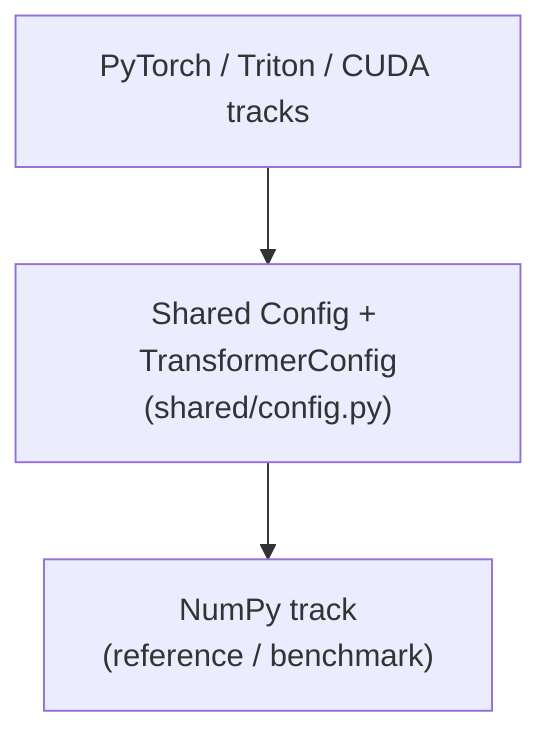

# Design Document: Decoder-Only Transformer Learning Project

**Date:** 2026-06-26 (last synced: 2026-10-09)
**Goal:** Build a fully functional decoder-only transformer LLM in 4 equivalent implementations (NumPy, PyTorch, Triton, CUDA) for educational purposes — covering the modern production surface: RoPE, GQA, SwiGLU, opt-in MoE (with shared experts), exact KV cache, TurboQuant, and speculative decoding (MTP + DSpark drafters).

## Track intent (doctrine)

Each track is written to teach a different skill — this guides every docstring
and comment choice:

- **NumPy = how the math works.** Every operator is hand-derived with formula
  citations and shape comments; the analytic backward is the lesson.
- **PyTorch = how to do it properly with a framework.** Production idiom:
  `nn.Module` composition, autograd, SDPA, `torch.optim`. Read it to learn
  how this model should be written in real code.
- **Triton = how to write the kernels.** Memory-traffic-aware kernels
  (online softmax) over the PyTorch skeleton.
- **CUDA = the bare metal.** NVRTC kernels, explicit launches, no framework.

When a track deviates from its simplest correct form, the deviation must
answer that track's question (e.g. Triton fuses because kernel fusion *is*
the lesson); pedagogical shortcuts that would mislead about production
practice get a `# PROD:` note instead.

## Cross-track naming (audited 2026-09, revised 2026-09-23)

Deliberate: every track owns `forward` + `load_from_numpy_dict` +
`get_all_parameters`/`save_as_numpy` and `make_cache` / `forward_prefill`
/ `forward_step` (the shared KV-step interface), and classes carry the
track prefix (`NumPyModel`, `TorchModel`, `TritonModel`, `CUDAModel`).
Known deltas, kept consciously:

- The NumPy `TextGenerator` skips the `NumPy…` prefix —
  that track is the reference, so its names are the unadorned canonical
  ones. The torch/triton/cuda generators are thin aliases over
  `shared/generator.py`'s generator (the single deep implementation), not
  parallel teaching artifacts — they've collapsed, not diverged.
- Every track publicizes the KV-step interface (`make_cache` /
  `forward_prefill` / `forward_step`) plus `forward_chunk` — k tokens'
  K/V appended in ONE pass, the speculative-decoding verification path
  (ADR 0003). The full-sequence `forward` stays as a parity oracle only
  (no re-forward anywhere at generation time).
- Drafters implement the `shared/draft.py` Drafter protocol and live as
  **sidecar checkpoints** (`<model>/draft_{mtp,dspark}/`) — the target's
  `ParameterRegistry` key set is untouched, so pre-ADR-0003 checkpoints
  stay valid and the drafter loads on all four tracks (round-trip:
  torch-distilled → NumPy-verified).
- `CUDAModel` is not an `nn.Module` — bare-metal track, plain tensor
  attributes; training collects grads by walking the block's tensor
  attributes (fixed 2026-09 — an earlier collector walked stale names).
- `ParameterRegistry.bind(binding)` is the single storage-binding
  materialization every track's save/load path walks (replaces the
  per-track key-list walkers; a drifted binding fails at `bind`, not at
  save-load time).

---

## Architecture



### Weight Flow

- All 4 backends accept the same JSON config + env vars → same model topology
- **Save**: NumPy `get_all_parameters()` / PyTorch `save_as_numpy()` / Triton `save_as_numpy()` / CUDA flat → `model.npz` (flat dict, via the shared `ParameterRegistry`)
- **Load**: NumPy `load_from_*` / PyTorch `load_from_*` / Triton `load_from_*` / CUDA flat assign
- **PyTorch↔Triton**: direct load via compatible `save_as_numpy()` / `load_from_numpy_dict()`
- **NumPy↔NumPy**: direct load (identical API)
- **NumPy↔CUDA**: direct load via shared flat format (no conversion needed)

---

## Project Structure

```text
project/
├── shared/           # Shared across backends: config, constants, checkpoint, data
│   ├── config.py     # TransformerConfig (frozen dataclass, one per model)
│   ├── constants.py  # Keys — parameter-name constants (HF-Llama scheme)
│   ├── registry.py   # ParameterRegistry: owner of the flat-dict checkpoint format
│   ├── tokenizer.py  # GPT-2 BPE (primary) + char-level tokenizer for demos
│   ├── dataset.py    # TinyStories loading → (input, target) batches
│   ├── sft_data.py   # SFT dataset helpers (prompt-masked targets)
│   ├── generator.py  # one deep TextGenerator over the KV-step interface
│   │                 #   (torch/triton/cuda consume it; numpy keeps its own
│   │                 #   teaching generator)
│   ├── draft.py      # Drafter protocol + sidecar checkpoint scheme (ADR 0003)
│   ├── spec_engine.py # torch-family speculative engine (greedy verification)
│   └── checkpoint.py # save/restore helpers (config.json + model.npz + vocab.json)
├── impl/
│   ├── _np/          # NumPy track (reference: hand-rolled math + backward)
│   │   ├── embedding.py / layernorm.py / rope.py     # single-purpose components
│   │   ├── attention.py  # MultiHeadAttention (GQA, KV cache, inline TurboQuant)
│   │   ├── ffn.py        # SwiGLU FFN
│   │   ├── moe.py        # MixtureOfExperts (router + top-k experts + shared experts)
│   │   ├── block.py      # TransformerBlock (RMSNorm → attn → residual → ...)
│   │   ├── stack.py      # DecoderStack (N blocks)
│   │   ├── model.py      # NumPyModel (embedding → stack → final norm → lm_head;
│   │   │                 #   make_cache / forward_prefill / forward_step)
│   │   ├── inference.py  # TextGenerator (greedy / sampled decoding)
│   │   ├── drafters.py    # MTP + DSpark drafters (the math reference)
│   │   ├── spec.py        # speculative engine: greedy verify + rejection sampling
│   │   ├── training.py / optimizer.py / cross_entropy.py / sft.py / gradcheck.py
│   │   ├── learning.py   # instrumented_forward + generate_with_records (records)
│   │   ├── learning_server.py # learning-mode HTTP server
│   │   └── web/          # the learning page (vanilla JS + KaTeX, no framework)
│   ├── _torch/       # PyTorch track (production ops: F.scaled_dot_product_attention)
│   │   ├── layers.py     # TorchModel + all nn.Module components (+ forward_chunk)
│   │   ├── drafters.py   # torch MTP + DSpark drafters (sidecar scheme, shared W_lm)
│   │   ├── learning.py   # torch record adapter + the shared spec-record helper
│   │   └── inference.py / training.py / sft.py / cli.py
│   ├── _triton/      # Triton GPU kernels (attn.py, flash_attn.py online softmax,
│   │                 #   ffn.py, moe.py; transformer.py + learning.py + sft.py)
│   ├── _cuda/        # CUDA bare-metal (kernels/, NVRTC compiler, per-track CLI)
│   └── (per-track) cli.py entry points: uv run python -m impl._<track>.cli
├── tests/
│   ├── unit/         # per-backend unit tests (_np/, _torch/, _triton/, _cuda/) + shared
│   └── cross_backend/ # parity tests between tracks (dense/GQA/MoE/spec
│                      #   decoding, GPU parity, 3-way; 62 tests)
└── docs/             # design.md, docstring_style.md, adr/, specs/, theory/
```

---

## Implementation Status

| Backend | Components | Tests | Status |
| --------- | ----------- | ------- | -------- |
| NumPy | Complete (Embedding, RMSNorm, RoPE, MHA, SwiGLU FFN, GQA, MoE, TransformerBlock, DecoderStack) | All pass | ✅ Complete |
| PyTorch | Complete (all layers match NumPy) | All pass | ✅ Complete |
| Triton | Complete (all kernels match NumPy) | All pass | ✅ Complete |
| CUDA | Complete (all kernels compiled + execute) | All pass | ✅ Complete |
| Speculative decoding | Complete on all four tracks: forward_chunk, MTP + DSpark drafters (NumPy + torch), greedy + rejection-sampling engines, sidecar checkpoints, distillation, learning-page integration | 62 parity + 21 np spec tests pass; 9/9 verify scenarios | ✅ Complete |

### NumPy Layer Summary

- **Embedding**: `vocab_size × embed_dim` trainable lookup table, no bias
- **RMSNorm**: per-dim scale — `x / rms(x) * gamma`, no bias (Zhang & Sennrich 2019)
- **RoPE**: 2D orthogonal rotation of (q, k) pairs by position (Su et al. 2021)
- **MHA**: Multi-Head Attention — supports KV cache and non-cached inference
- **SwiGLU FFN**: gated linear unit variant with SiLU activation
- **MoE**: Mixture of Experts — multiple feed-forward expert sub-layers, gated routing
- **GQA**: Grouped-Query Attention — groups query heads into key/value groups for KV cache efficiency
- **MoE router/shared expert**: softmax-over-all → top-k mask → renormalize; shared experts always-on, ungated, averaged (ADR 0002)
- **Speculative drafters**: MTP (one conditioned block, own KV cache, sequential) and DSpark (parallel non-causal backbone + causal refinement, learned block-position embeddings) — `impl/_np/drafters.py`
- **Speculative engine**: greedy acceptance walk (repetition-guarded argmax comparison) + the rejection-sampling theorem; DSpark survival schedule — `impl/_np/spec.py`
- **Residual**: standard additive skip connection `out = x + f(ln(x))` (see [ADR-0001](adr/0001-gated-residual-abandonment.md))
- **TransformerBlock**: one layer — RMSNorm → MHA → residual → RMSNorm → FFN → residual
- **DecoderStack**: N-layer stack; the model applies embedding → stack → final RMSNorm → lm_head

---

## Cross-Backend Parity

### Training Parity (Weight Diff After 1 Iteration)

| Comparison | Weight Diff | Inference Diff |
| ----------- | ------------ | ---------------- |
| NumPy vs PyTorch | `~1e-4` | `~1e-5` |
| NumPy vs Triton | `~1e-2` | `~1e-1` |
| NumPy vs CUDA | `~1e-2` | `~1e-1` |

### Inference Parity (Same Weights, Same Input)

| Comparison | Token Diff | Max Prob Diff |
| ----------- | ----------- | --------------- |
| NumPy vs PyTorch | `~1e-4` | `~1e-5` |
| NumPy vs Triton | `~1e-2` | `~1e-2` |
| NumPy vs CUDA | `~1e-2` | `~1e-2` |

---

## Training & Inference

### Training

- **Loss function**: Cross-entropy (label smoothing = 0.0)
- **Optimizer**: AdamW (β1=0.9, β2=0.999, eps=1e-8), fixed learning rate
  (no scheduler — learning-rate scheduling is deliberately out of scope)
- **Gradient clipping**: Norm clipping (max_norm=1.0)
- **Batch size**: Context-length chunks for next-token prediction (e.g., 32×256)
- **Data pipeline**: Tokenizer → TokenizedDataset → DataLoader → forward → loss → step

### Inference

- **Greedy decoding**: `argmax(logits)` → deterministic, best for testing
- **Weighted sampling**: Sample from softmax(logits / temperature) → stochastic
- **KV Cache**: Full caching of past key/value tokens; the per-token step
  path (`forward_prefill` + `forward_step`) is exact, one token per
  iteration. TurboQuant (1-bit quantized cache) is a documented,
  parity-budgeted alternative behind `forward_step(quantize=True)`.
- **Speculative decoding** (ADR 0003): a distilled drafter proposes a k-token
  block; the target verifies it in one `forward_chunk` pass; the longest
  agreeing prefix commits (greedy: token-identical to plain decoding — the
  lossless contract; NumPy also implements the rejection-sampling theorem
  for temperature mode). Drafters: MTP (sequential, k=4) and DSpark
  (semi-AR parallel + causal refine, k=8, confidence-scheduled verification
  at a 0.8 survival target), sidecar checkpoints, both sharing the target's
  embedding + lm_head. See docs/specs/speculative-decoding.md.

---

## Platform Target

| Component | Value |
| ----------- | ------- |
| **Device** | NVIDIA Jetson AGX Orin 64GB |
| **OS** | JetPack 7.2.1 |
| **CUDA** | CUDA 13.2 |
| **PyTorch** | PyTorch 2.13.0+cu132 (pinned `pytorch-cu132` uv index) |
| **GPU** | 2048 CUDA cores, 64-bit memory, ~20 TFLOPS |

---

## Key Design Decisions

1. **4 backends, same topology** — All accept JSON config, produce same model structure
2. **NumPy as truth benchmark** — Pure Python/numpy implementation used as the reference for all other backends
3. **Independent training** — Each backend trains independently with its own random seed, but should produce equivalent weights
4. **Round-trip tests** — Save to NumPy format, load into any backend, verify inference matches
5. **Flat checkpoint format** — All backends save/load `model.npz` as a flat dict (keys from the shared `Keys` scheme), enabling cross-backend transfer
6. **Standard additive residual** — the block uses the plain pre-norm skip `out = x + f(ln(x))`, matching LLaMA and every modern reference (the repo-specific "gated residual" was abandoned — see [ADR-0001](adr/0001-gated-residual-abandonment.md))
7. **Config-bounded KV cache** — the cache is the model's dict cache
   (`make_cache` / `forward_prefill` / `forward_step`) with TurboQuant 1-bit
   quantization as the documented alternative; LRU/LFU multi-level caching
   was explicitly rejected as out of scope
8. **PyTorch nn.Module wrapper** — PyTorch/Triton models are `nn.Module` instances (training via `.parameters()`); `CUDAModel` is a plain class whose tensor attributes carry `requires_grad`
9. **Drafter sidecars, not registry keys** — draft weights live outside the
   target's `model.npz` (ADR 0003): the checkpoint format and every
   existing checkpoint stay untouched; drafters load per request and the
   same sidecar runs on all four tracks
